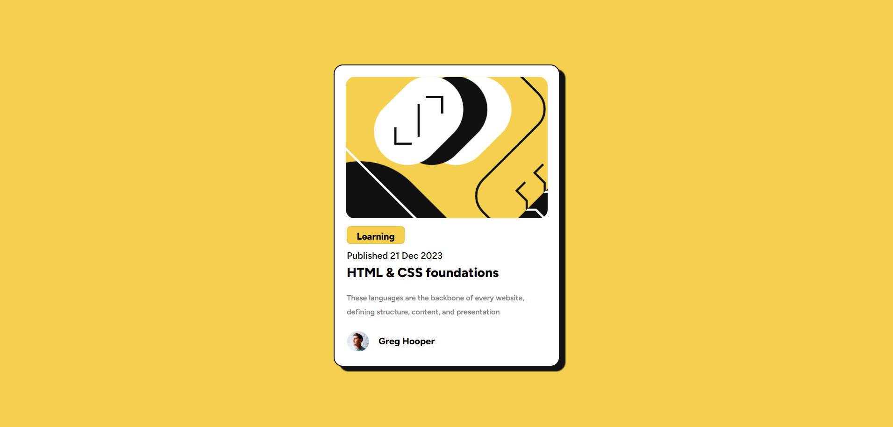

# Frontend Mentor - Blog preview card solution

This is a solution to the [Blog preview card challenge on Frontend Mentor](https://www.frontendmentor.io/challenges/blog-preview-card-ckPaj01IcS). Frontend Mentor challenges help you improve your coding skills by building realistic projects. 

## Table of contents

- [Overview](#overview)
  - [The challenge](#the-challenge)
  - [Screenshot](#screenshot)
  - [Links](#links)
- [My process](#my-process)
  - [Built with](#built-with)
  - [What I learned](#what-i-learned)
  - [Continued development](#continued-development)
  - [Useful resources](#useful-resources)
- [Author](#author)

## Overview

A project challenged by [Frontend Mentor](https://www.frontendmentor.io)

### The challenge

Users should be able to:

- See hover and focus states for all interactive elements on the page

### Screenshot

### Links

- Solution URL: [GitHub respository](https://github.com/ViniCellist/Frontend-Mentor-Blog-Preview-Card-Main)
- Live Site URL: [Vercel](https://frontend-mentor-blog-preview-card-main-nine.vercel.app/)

## My process

I started creating the HTML structure, then added the style after...

### Built with

- HTML5
- CSS3
  - Flexbox

### What I learned

Learned how to proper separate a line height in a text. Using `line-height:`...

### Continued development

Keep my focus on becoming a fullstack Dev...

### Useful resources

- [CSS line-height](https://www.loopnerd.com.br/codigos-css-prontos/espaco-entre-linhas-css/#:~:text=Podemos%20usar%20a%20propriedade%20CSS,aumentar%C3%A1%20ou%20diminuir%C3%A1%20de%20acordo.) - This helped me to separate the text.

## Author

- GitHub - [Personal Profile](https://github.com/ViniCellist)
- Frontend Mentor - [Frontend Mentor profile](https://www.frontendmentor.io/profile/ViniCellist)
- LinkedIn - [Professional Profile](https://www.linkedin.com/in/viniciussouzaduarte/)
- Instagram - [Personal Profile](https://www.instagram.com/vinicius_duartesd/)
